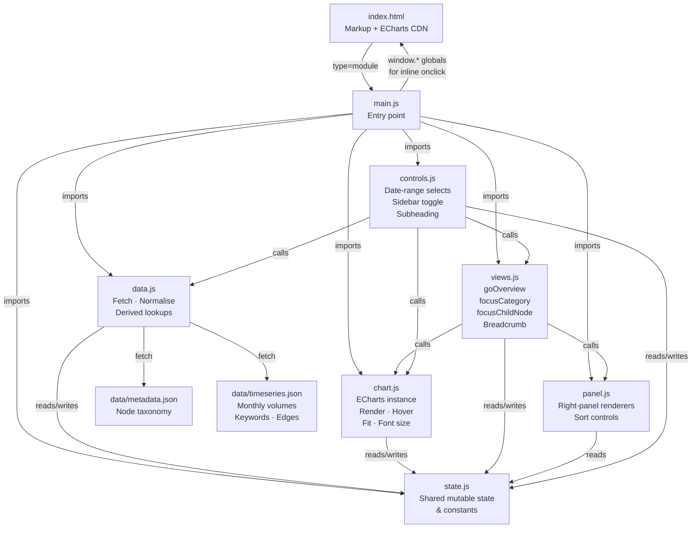
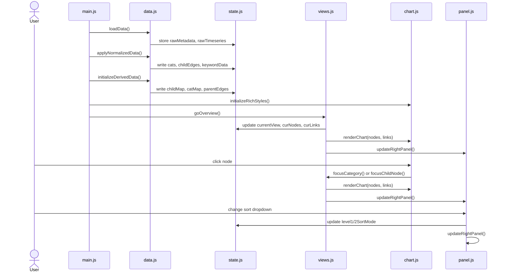

# AI / ML Trend Explorer

An interactive graph visualisation of AI/ML research trends derived from arXiv paper statistics. Topics are grouped into categories, connected by co-occurrence edges, and colour-coded by trend direction (heating up / cooling off / stable).

**ATTENTION**: The [live demo](https://manhowong.github.io/ai-trends/) uses mock data. 

---

## Architecture



### Module responsibilities

| Module | Responsibility |
|---|---|
| `main.js` | Boots the app; wires all DOM and ECharts event listeners; exposes five functions as `window` globals for use in panel-generated HTML |
| `state.js` | Single `state` object holding all mutable data — raw JSON, derived maps, view state, sort modes, font size, rich styles |
| `data.js` | Fetches JSON; computes per-node paper volumes and hotness over the selected date range; builds `childEdges`, `keywordData`, and the category-level `parentEdges` lookup |
| `chart.js` | Owns the ECharts instance; provides `renderChart`, `applyHover`/`clearHover`, `fitScreen`, `updateFontSize`, rich-label helpers (`makeLabel`, `buildRichStyles`) |
| `views.js` | Implements the three views (`goOverview`, `focusCategory`, `focusChildNode`); places nodes on circular layouts and assembles link lists; updates the breadcrumb |
| `panel.js` | Renders the right-panel info boxes and sort dropdowns for each view; exposes `setSortMode` which is called from inline `onchange` handlers in generated HTML |
| `controls.js` | Manages the date-range `<select>` elements and triggers a full data re-derive + re-render on change; handles sidebar collapse and the subheading text |

## Data Flow



## Getting Started

The app fetches JSON at runtime so it must be served over HTTP — opening `index.html` directly as a `file://` URL will not work.

Any static file server will do:

```bash
# Python
python -m http.server 8080

# Node (npx)
npx serve .

# VS Code
# Use the Live Server extension
```

Then open `http://localhost:8080` in your browser.

## Adding Data

- **`data/metadata.json`** — defines the node taxonomy. Each node needs `L` (level: 1 or 2), `N` (name), and for L2 nodes `P` (parent category id).
- **`data/timeseries.json`** — keyed by month string (`"YYYY-MM"`). Each month contains `nodes_L1`, `nodes_L2` (with `V` monthly volume and `VC` cumulative volume), `links` (with `S`, `T`, `J` Jaccard similarity), and per-node `K` keyword arrays.
