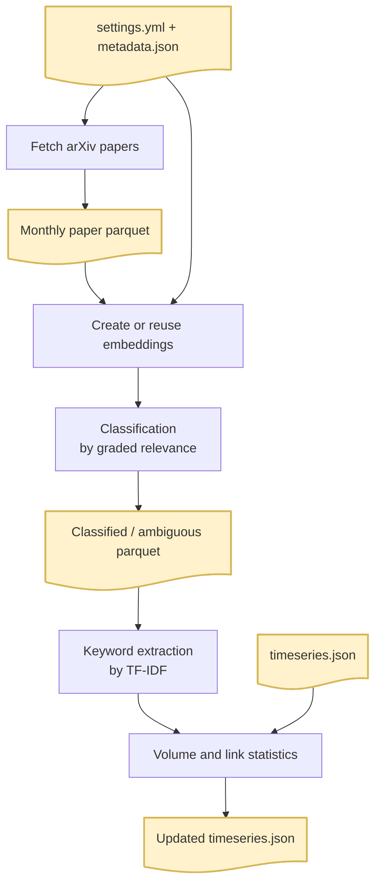

# AI / ML Trend Explorer

### **[ Ongoing Project ]**

## Project Overview

Existing tools either operate at the paper level (Semantic Scholar, Connected Papers) or use unsupervised topic discovery (LDA, BERTopic) that produces *unlabelled, temporally unstable clusters* unsuitable for consistent trend tracking. 

The goal of this project is to develop a taxonomy-driven semantic classification framework that enables consistent, long-term trend tracking across the arXiv corpus. To achieve this, the project adopts the following approaches:

- **Semantic classification** over a stable, human-validated taxonomy: topics are consistently defined across time periods
- **Graded topic assignment** rather than hard single-label classification, preserving the cross-disciplinary nature of modern research
- **Trend signals based on topic share**, not raw volume: robust to the overall growth of the arXiv corpus
- **Co-occurrence graph with normalized edge weights (DSC)**: reveals the relational structure of the field, not just a ranked list of topics

## Dashboard

An interactive graph of AI/ML research trends derived from arXiv article statistics. Topics are grouped into categories, connected by co-occurrence edges (relevance measured by DSC), and colour-coded by trend direction (heating up / cooling off / no trends detected).

**Dashboard links:**
- [GitHub Page](https://manhowong.github.io/ai-trends/)
- [Mirror Page](https://explore-ai-trends.netlify.app/)

## Core Pipeline

See [Pipeline Readme](./pipeline/README.md) and [Pipeline Demo Notebook](./pipeline/demo.ipynb).

```mermaid
flowchart TD
    A@{ shape: doc, label: "settings.yml + metadata.json" } --> B[Fetch arXiv papers]
    B --> C@{ shape: doc, label: "Monthly paper parquet" }
    C --> D[Create or reuse embeddings]
    A --> D
    D --> E[Classification \nby graded relevance]
    E --> F@{ shape: doc, label: "Classified / ambiguous parquet" }
    F --> G[Keyword extraction \nby TF-IDF]
    G --> H[Volume and link statistics]
    I@{ shape: doc, label: "timeseries.json" } --> H
    H --> J@{ shape: doc, label: "Updated timeseries.json" }

    %% Custom Yellow Style for File Blocks
    classDef fileStyle fill:#fff2cc,stroke:#d6b656,stroke-width:2px;
    class A,C,F,I,J fileStyle;

```

## Methodology

See [Project Documentation](./docs/documentation.md).