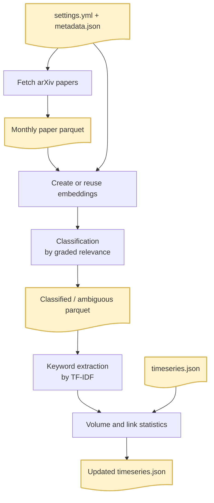

**Project Documentation**

- [Project Overview](#project-overview)
- [Data Pipeline](#data-pipeline)
  - [Overview](#overview)
  - [Data Source](#data-source)
  - [Automated Update](#automated-update)
  - [Data Structure](#data-structure)
- [Classification](#classification)
  - [Stage 1: Embedding Similarity](#stage-1-embedding-similarity)
  - [Stage 2 (Planned): LLM Review for Ambiguous Cases](#stage-2-planned-llm-review-for-ambiguous-cases)
- [Keyword Extraction](#keyword-extraction)
- [Evaluation and Accuracy](#evaluation-and-accuracy)
- [Taxonomy](#taxonomy)
  - [Structure](#structure)
  - [Methodology and Design](#methodology-and-design)
- [Statistics](#statistics)
  - [Article Count (V)](#article-count-v)
  - [Topic Hotness](#topic-hotness)
  - [Links and Relevance (DSC)](#links-and-relevance-dsc)
  - [Node Size](#node-size)
- [Appendix](#appendix)
  - [Areas](#areas)
  - [Topics](#topics)


# Project Overview

Existing tools either operate at the paper level (Semantic Scholar, Connected Papers) or use unsupervised topic discovery (LDA, BERTopic) that produces *unlabelled, temporally unstable clusters* unsuitable for consistent trend tracking. 

The goal of this project is to develop a taxonomy-driven semantic classification framework that enables consistent, long-term trend tracking across the arXiv corpus. To achieve this, the project adopts the following approaches:

- **Semantic classification** over a stable, human-validated taxonomy: topics are consistently defined across time periods
- **Graded topic assignment** rather than hard single-label classification, preserving the cross-disciplinary nature of modern research
- **Trend signals based on topic share**, not raw volume: robust to the overall growth of the arXiv corpus
- **Co-occurrence graph with normalized edge weights (DSC)**: reveals the relational structure of the field, not just a ranked list of topics

# Data Pipeline

## Overview

The following diagram shows the overall flow of the pipeline. For detailed usage, see [Pipeline Readme](https://github.com/manhowong/ai-trends/blob/main/pipeline/README.md) in the project's repository.



## Data Source

Articles are sourced from [arXiv.org](https://arxiv.org) via its public API. The dataset covers AI and machine learning research across the following categories, selected manually based on their relevance to and coverage of AI or ML topics. Essentially, these categories are most likely to capture current trends in AI development.

| Category | Description |
|---|---|
| `cs.LG` | Machine Learning |
| `cs.AI` | Artificial Intelligence |
| `cs.CL` | Computation and Language |
| `cs.CV` | Computer Vision and Pattern Recognition |
| `cs.NE` | Neural and Evolutionary Computing |
| `cs.RO` | Robotics |
| `cs.IR` | Information Retrieval |
| `cs.CR` | Cryptography and Security |
| `cs.HC` | Human-Computer Interaction |
| `cs.MA` | Multiagent Systems |
| `cs.GT` | Computer Science and Game Theory |
| `stat.ML` | Machine Learning (Statistics) |
| `stat.AP` | Applications (Statistics) |
| `econ.GN` | General Economics |
| `q-bio.QM` | Quantitative Methods (Quantitative Biology) |

While some niche categories cover domain-specific AI topics (e.g., in Physics or Quantitative Finance), relevant articles in those fields are usually cross-submitted to one of the main categories listed above. Cross-submissions are deduplicated by arXiv ID, so each article is counted only once. For more details, see the [arXiv Category Taxonomy](https://arxiv.org/category_taxonomy).

> ### Current stage
> 
> **arXiv coverage only.** Conference papers, journal articles, and blog posts are not included. Because arXiv preprints skew towards certain subfields, node sizes may not reflect absolute research volume across the field as a whole. However, trend detection is based on relative shifts within each topic over time, so this bias is internally normalised. Preprints also have the advantage of faster publication cycles, making them more responsive to emerging trends than peer-reviewed venues.
> 
> **Only preliminary data are currently available.** Historical data for the previous year is planned to be backfilled and will serve as the baseline for trend computation.

## Automated Update

The dataset will be updated automatically on the first Sunday of each month via GitHub Actions, covering all articles from the previous month. **Note**: Automated updates are not currently active as I am working on the API request rate limit.

## Data Structure

Articles are classified into **topics** based on their abstracts (see [Classification](#classification)), which are then clustered into **areas** (see [Taxonomy](#taxonomy)). The data pipeline outputs two JSON files: `metadata.json` and `timeseries.json`:

**metadata.json**

```json
{
  "nodes": {
    "A": { "N": "Learning Paradigms", "L": 1 },
    "A01": { "N": "Supervised Learning", "L": 2, "P": "A" }
  }
}
```

**timeseries.json**

```json
{
  "2026-01": {
    "nodes_L1": {
      "A": { "V": 100, "VC": 1000 }
    },
    "nodes_L2": {
      "A01": { "V": 40, "VC": 400, "P": "A", "K": [{"N": "keyword1", "V": 10}] }
    },
    "links": [
      { "S": "A", "T": "B", "C": 12, "CC": 120 },
      { "S": "A01", "T": "A02", "C": 5, "CC": 50 }
    ]
  }
}
```

**Raw Dataframe processed by the data pipeline**

| arxiv_id | YYYY-MM | T1 | T1_cos_sim | T2 | T2_cos_sim | T3 | T3_cos_sim | TU | K | method |
|---|---|---|---|---|---|---|---|---|---|---|
| 2401.00001 | 2026-01 | ["A07"] | [0.91] | ["D01", "B01"] | [0.83, 0.74] | ["F01"] | [0.71] | [] | ["few-shot"] | emb |
| 2401.00002 | 2026-01 | ["D03", "D04"] | [0.72, 0.71] | [] | [] | [] | [] | ["Quantum ML"] | ["RLHF"] | llm |

**Explanations**

| Field | Full Name | Data Type | Description |
|---|---|---|---|
| arxiv_id | arXiv Identifier | string | Unique paper ID from arXiv |
| YYYY-MM | Year-Month | string | Month the paper was published |
| T1 | Primary Topic | list of strings (max 2) | Most relevant L2 node IDs |
| T1_cos_sim | Primary Topic Score | list of floats (max 2) | Cosine similarity scores for T1 |
| T2 | Secondary Topic | list of strings (max 3) | Second most relevant L2 node IDs |
| T2_cos_sim | Secondary Topic Score | list of floats (max 3) | Cosine similarity scores for T2 |
| T3 | Tertiary Topic | list of strings (max 3) | Third most relevant L2 node IDs |
| T3_cos_sim | Tertiary Topic Score | list of floats (max 3) | Cosine similarity scores for T3 |
| TU | Unclassified Topics | list of strings | Free-text topic suggestions outside the taxonomy |
| K | Keywords | list of strings | Key terms or phrases extracted from the paper (0–10 items) |
| method | Classification Method | string | Method used: "emb" for embedding, "llm" for LLM |
| N | Name | string | Human-readable label of a node or keyword |
| L | Level | integer | Hierarchy level: 1 = category, 2 = topic |
| P | Parent | string | Parent node ID of an L2 node |
| V | Volume | integer | Monthly paper mention count for a node |
| VC | Cumulative Volume | integer | Running total of mentions across all months |
| S | Source | string | Source node ID in a link |
| T | Target | string | Target node ID in a link |
| C | Co-mentions | integer | Number of co-mentions between two nodes in a given month |
| CC | Cumulative Co-mentions | integer | Running total of co-mentions across all months |

# Classification

Each article is classified into one or more predefined topics (see [Appendix](#appendix)) based on its abstract. Classification runs in two stages.

## Stage 1: Embedding Similarity

The abstract is encoded into a dense vector using [BAAI/bge-small-en-v1.5](https://huggingface.co/BAAI/bge-small-en-v1.5), a sentence embedding model well-suited to short scientific text. This vector is compared against the embeddings of all topic descriptions using cosine similarity, producing a relevance score for every topic.

Rather than matching exact keywords, this approach compares the semantic meaning of the abstract against topic descriptions, placing it between strict keyword matching and fully unsupervised topic discovery. For example, a paper about "policy gradient methods" will match *Reinforcement Learning* even if that exact phrase never appears in the abstract.

Topics that score above a confidence threshold are assigned to relevance tiers (T1, T2, T3) in ranked order (see [Topic Assignment Logic](#topic-assignment-logic)). Articles where no topic clears the threshold are flagged as ambiguous and passed to Stage 2.

> ### Topic Assignment Logic
> 
> Topics are first ranked by their similarity to each article as measured by cosine similarity ($s$). Topics passing the **confidence threshold** ($s \ge 0.79$) are assigned to Tiers 1 through 3:
> 
> - **T1** (Primary, max 2): Includes the top-ranked topic and any topic within the **similarity gap** ($\le 0.02$).
> - **T2** (Secondary, max 3): The next-ranked candidates  after assigning T1.
> - **T3** (Tertiary, max 3): The next-ranked candidates after assigning T2.
>  
> Any topics that do not qualify for the tiers above are filtered by the **relevance threshold** ($s \le 0.50$):
> 
> - **Ambiguous:** If an article has no topics reaching the confidence threshold ($0.79$) but does have topics passing the relevance threshold ($0.50$), it is labeled "Ambiguous" and requires further processing (e.g. LLM review).
> - **Discarded:** Articles failing to reach the relevance threshold for any topic are discarded.

## Stage 2 (Planned): LLM Review for Ambiguous Cases

Ambiguous articles are those where Stage 1 finds no topics above the confidence threshold, but some topics may still score above a relevance threshold  (e.g. **out-of-scope topics** that not covered by the predefined taxonomy). For these cases, the top-5 candidate topics from Stage 1 are passed to a language model alongside the abstract, which selects the best-fitting topics and assigns tiers following the same rules as Stage 1.

This stage has not yet been implemented. The preliminary data therefore contains only articles classified above the confidence threshold in Stage 1; ambiguous articles are currently excluded from all statistics.

# Keyword Extraction

For each topic, representative terms are extracted using **TF-IDF** (Term Frequency-Inverse Document Frequency), after lemmatization with [spaCy](https://spacy.io/). TF-IDF down-weights terms that appear across many topics (e.g. "training", "model") and highlights terms distinctive to a specific topic. The dashboard aggregates these term counts across the selected date range for currently active topics and shows the highest-volume terms in the info panel.

Terms with zero volume in the selected range are not shown. As with classification, an LLM review step may be incorporated in the future to improve term quality.

# Evaluation and Accuracy

At the current confidence threshold, the pipeline assigns topics to approximately 20% of articles. Whether this coverage is sufficient to capture reliable trend signals, and whether the classification is accurate enough for this purpose, has not been formally evaluated yet.

The unclassified 80% is not necessarily a problem. Ambiguous cases include not only borderline-relevant articles but also articles with short or unclear abstracts, truly irrelevant articles, and spam. Classifying all articles is neither possible nor necessary. Improving coverage through LLM review or a tuned embedding model (e.g. a larger or domain-specific model) is possible, but given the project's consideration of cost and environmental sustainability, any such improvement needs to be weighed against the additional compute required.

Formal evaluation is also constrained by the lack of suitable benchmark data. Accurate manual labelling would require domain experts across all AI fields, which is not currently feasible. As a proxy, we plan to assess internal consistency using the extracted terms and co-occurrence patterns. The preliminary results are encouraging: manual inspection of the top terms and connections of randomly selected topics appear coherent. For example, for the topic `RLHF / RLAIF`:

| | Top 3 |
|---|---|
| Frequent terms | `human feedback`, `human preference`, `reward model` |
| Intra-area connections (Post-Training & Adaptation) | `Direct Preference Optimization`, `Prompt Engineering & Prompt Tuning`, `In-Context Learning` |
| Inter-area connections | `Reinforcement Learning` (Learning Paradigms), `AI Alignment`, `Human-AI Interaction` (Safety & Society) |

As the dataset grows, we expect trend signals and representative terms to strengthen as noise is naturally filtered out by sample size. Suggestions on evaluation methods are welcome!

# Taxonomy

## Structure

The taxonomy is organized into a two-level hierarchy:

* **Areas (A-I):** Nine broad research areas. Statistics at the area level are aggregated from their child topics.
* **Topics:** 125 specific research concepts, each mapped to a single parent area.

See all topics and areas [here](#appendix).


## Methodology and Design

The initial taxonomy was designed manually, informed by two primary references: the [ACM Computing Classification System (CCS)](https://dl.acm.org/ccs), the standard subject classification scheme for computing research, and the [arXiv category taxonomy](https://arxiv.org/category_taxonomy), which defines the subject categories used for preprint submissions.

Topics within each area were selected to be specific enough to provide meaningful insights, yet broad enough to maintain sufficient article volumes for trend analysis.

Before finalization, the draft underwent multiple rounds of **LLM-assisted iterative revisions**. The output of each round was manually inspected and validated by a subject matter expert in computer science and neuroscience (the author). Descriptions for each area and topic were developed through a similar iterative process and were only finalized once human-AI alignment was achieved.

> ### Current Limitations and Next Steps
> 
> **Only 20% of articles are currently classified.** Coverage will improve with LLM review and embedding model tuning.
> 
> **An article can be assigned to multiple topics.** The current statistics include assigned topics of all relevance tiers, i.e. an article can be assigned to multiple topics regardless of the primary focus of the article. This helps identify cross-field connections through topic co-occurrence.
> 
> **Classification is importance-agnostic.** Whether a topic is the primary contribution, a method used, or merely an application domain are currently weighted equally. This captures how broadly a topic is discussed across fields (see above), but does not distinguish active research fronts from mature topics or background knowledge. Future improvements may include a dashboard filter to show only primary-topic assignments, probabilistic labels, or scores weighted by topic importance.
> 
> **The taxonomy is predefined.** This is because a completely unsupervised method would produce unlabelled data, unstable across time periods and often difficult to interpret. Very niche or emerging research directions that fall outside existing topics will be logged as uncovered topics (TU) in the future. The TU log will inform future taxonomy revisions.

# Statistics

## Article Count (V)

**Article Count ($V$)** represents the volume of arXiv articles assigned to a specific **topic** within the selected date range.

* **Topic Nodes**: An article can be assigned to more than one topic (see [Classification](#classification)); therefore, a single article may contribute to the $V$ of multiple topics simultaneously. This is intentional, as most ML/AI papers are interdisciplinary.
* **Area Nodes**: For areas, $V$ is the sum of the volumes of their child topics (visible topics after applying the filters in the dashboard). Because an article can belong to topics in different areas, the same article may contribute to the $V$ of multiple areas.
* **Filtering matters**: The dashboard filters topics by minimum article count before rolling them up to area level, so changing topic-level filters also changes area totals.

## Topic Hotness

Topic hotness indicates whether a topic's share of activity is increasing or decreasing. It measures the percent change in a topic's **share of total articles** between the selected start and end periods (i.e., Period-to-Period change):

$$
\text{Hotness} =
\begin{cases}
\text{n.a.}, & \text{if } V_{\text{start}} < \epsilon \text{ and } V_{\text{end}} < \epsilon \\
\left(\dfrac{S_{\text{end}} - S_{\text{start}}}{S_{\text{start}}}\right) \times 100\%, & S_{\text{start}} > 0 \\
S_{\text{end}} \times 100\%, & S_{\text{start}} = 0
\end{cases}
$$

Where $\epsilon$ is the minimum article count, $S_{\text{start}} = V_{\text{start}} / V^{\text{total}}_{\text{start}}$ and $S_{\text{end}} = V_{\text{end}} / V^{\text{total}}_{\text{end}}$ are the topic's shares at the selected endpoints. 
The result is rounded to the nearest integer.

**Trend Classification:**

* **Heating Up**: Hotness $\ge 20\%$
* **Cooling Off**: Hotness $\le -20\%$
* **No Trends Detected**: Hotness between $-20\%$ and $20\%$

> **Note:** These thresholds come from `config/settings.yml` and are currently set to `trend_volume_threshold: 10` ($\epsilon$) and `trend_boundary: 20`. In the dashboard, `n.a.` means only one time period is selected, or both endpoint volumes are below the minimum volume threshold.

## Links and Relevance (DSC)

A **link between two topic nodes** indicates co-occurrence: articles assigned to both topics. The link width reflects the strength of that relationship, measured by the **Dice-Sørensen Coefficient (DSC)**:

$$\text{DSC}(A, B) = \frac{2 \, |A \cap B|}{|A| + |B|}$$

Where $|A|$ and $|B|$ are the article counts ($V$) for topics $A$ and $B$, and $|A \cap B|$ is the number of articles assigned to both topics within the selected range.

DSC ranges from 0 (no co-occurrence) to 1 (complete overlap), expressed as a percentage in the dashboard. A wider link indicates that two topics appear together frequently relative to their individual frequencies.

In the dashboard, topic links are shown only when their DSC is above the current edge threshold. Area-level links are aggregates of visible topic-level links, so topic filtering also affects area links.

## Node Size

Node size is proportional to $\sqrt{V / V_{\text{total}}}$, where $V_{\text{total}}$ is the sum of $V$ across all nodes currently visible in the current view. Using the square root compresses the scale so that high-volume topics do not visually overwhelm the graph, while still preserving distinct relative differences.

**Note:** The scale is recalculated independently for each view. Sizes are meaningful *within* the current view but should not be compared across different views.

# Appendix

## Areas

| ID | Area | Description |
|---|---|---|
| A | Learning Paradigms | The core learning approach or training signal used to train a model |
| B | Model Architectures | The structural design of neural networks and machine learning models |
| C | Training & Optimization | Techniques and algorithms for training models from scratch or improving the training process |
| D | Post-Training & Adaptation | Methods applied to a model after initial pre-training to specialize or compress it |
| E | Capabilities & Tasks | The specific problem being solved or cognitive capability being studied |
| F | Applications | The real-world domain or field in which ML methods are applied |
| G | Evaluation & Theory | Theoretical analysis, empirical measurement, and formal understanding of ML systems |
| H | Systems & Infrastructure | Engineering, tooling, and infrastructure aspects of building and deploying ML systems |
| I | Safety & Society | Safety, ethics, fairness, and societal impact of ML systems |


## Topics

| ID | Topic | Description | Parent ID |
|---|---|---|---|
| A01 | Supervised Learning | Learning from labeled input-output pairs using explicit supervision signals | A |
| A02 | Unsupervised Learning | Learning structure or representations from unlabeled data without explicit supervision | A |
| A03 | Reinforcement Learning | Learning through interaction with an environment via reward signals, including model-based, model-free, multi-agent, and inverse RL | A |
| A04 | Semi-supervised Learning | Learning from a mix of labeled and unlabeled data to reduce annotation requirements | A |
| A05 | Self-supervised Learning | Learning representations using automatically generated supervision from the data itself, including contrastive, masked, and predictive approaches | A |
| A06 | Federated Learning | Distributed learning across decentralized data sources without sharing raw data | A |
| A07 | Few-shot & Zero-shot Learning | Learning to generalize to new tasks with very few or no labeled examples | A |
| A08 | Active Learning | Iteratively selecting the most informative samples for labeling to reduce annotation cost | A |
| A09 | Online Learning | Learning incrementally from a stream of data arriving sequentially over time | A |
| A10 | Continual / Lifelong Learning | Learning new tasks over time without catastrophically forgetting previously learned knowledge | A |
| A11 | Multi-task Learning | Jointly learning multiple related tasks to improve generalization across all of them | A |
| A12 | Imitation Learning | Learning behaviors by mimicking demonstrations from an expert agent | A |
| A13 | Meta-Learning | Learning to learn, enabling rapid adaptation to new tasks with minimal data | A |
| A14 | Transfer Learning | Applying knowledge learned from one domain or task to improve performance on another | A |
| A15 | Domain Adaptation | Adapting a model trained on a source domain to perform well on a different target domain | A |
| B01 | Transformers & Attention Mechanisms | Sequence models based on self-attention, including variants like BERT, GPT, and Vision Transformers | B |
| B02 | Convolutional Neural Networks | Feedforward networks using local convolutional filters, primarily for structured grid data like images | B |
| B03 | Recurrent Neural Networks | Sequential models with hidden state memory, including LSTM and GRU variants | B |
| B04 | Graph Neural Networks | Neural networks that operate on graph-structured data via message passing between nodes | B |
| B05 | Mixture of Experts | Architectures that route inputs to specialized sub-networks to increase model capacity efficiently | B |
| B06 | Diffusion Models | Generative models that learn to reverse a gradual noising process to produce samples | B |
| B07 | VAEs | Variational Autoencoders that learn latent representations by optimizing an evidence lower bound | B |
| B08 | GANs | Generative Adversarial Networks that train a generator and discriminator in an adversarial game | B |
| B09 | Tree-based Models | Ensemble and decision tree methods including Random Forests, XGBoost, and gradient boosting | B |
| B10 | Probabilistic Graphical Models | Models representing joint distributions via graph-structured conditional independencies | B |
| B11 | Neural ODEs & Continuous Models | Neural networks defined by continuous-time dynamics via ordinary differential equations | B |
| B12 | Physics-Informed Neural Networks | Neural networks that incorporate physical laws and constraints into their training objectives | B |
| B13 | Equivariant & Geometric Deep Learning | Networks designed to respect geometric symmetries and transformations in data | B |
| B14 | Spiking Neural Networks | Biologically inspired networks that communicate via discrete spike events over time | B |
| B15 | Neuro-symbolic Architectures | Hybrid models combining neural learning with symbolic reasoning or logic | B |
| B16 | State Space Models | Sequence models using structured state-space representations, including Mamba and S4 | B |
| C01 | Optimization Algorithms | First- and second-order gradient-based methods for minimizing training objectives, including SGD and Adam | C |
| C02 | Regularization | Techniques to reduce overfitting by constraining model complexity, including dropout and weight decay | C |
| C03 | Normalization | Methods for stabilizing activations during training, including BatchNorm, LayerNorm, and RMSNorm | C |
| C04 | Neural Architecture Search | Automated methods for discovering optimal neural network architectures | C |
| C05 | AutoML & Hyperparameter Optimization | Automated selection of model types and hyperparameters to maximize performance, including Bayesian optimization approaches | C |
| C06 | Data Augmentation | Transformations applied to training data to artificially increase diversity and improve generalization | C |
| C07 | Distributed / Parallel Training | Strategies for training models across multiple devices or machines simultaneously | C |
| C08 | Evolutionary & Genetic Algorithms | Optimization using population-based, biologically inspired search and selection procedures | C |
| C09 | Loss Function Design | Crafting or learning objective functions to better align training with task goals | C |
| C10 | Gradient Techniques | Methods for managing gradients during training, including clipping, accumulation, and checkpointing | C |
| C11 | Mixed Precision Training | Training with reduced floating-point precision to accelerate computation and reduce memory usage | C |
| C12 | Tokenization & Preprocessing | Converting raw inputs into discrete tokens or normalized representations, including BPE and SentencePiece | C |
| D01 | Supervised Fine-Tuning | Adapting a pre-trained model to a downstream task using labeled examples | D |
| D02 | Parameter-Efficient Fine-Tuning | Fine-tuning methods that update only a small subset of parameters, including LoRA, adapters, and QLoRA | D |
| D03 | RLHF / RLAIF | Aligning model outputs with human or AI preferences using reinforcement learning feedback | D |
| D04 | Direct Preference Optimization | Alignment methods that optimize preference data directly without a separate reward model, including DPO variants | D |
| D05 | Quantization | Reducing model weight or activation precision to lower memory and inference cost | D |
| D06 | Pruning | Removing weights, neurons, or attention heads to reduce model size and computation | D |
| D07 | Knowledge Distillation | Transferring knowledge from a large teacher model to a smaller student model | D |
| D08 | Prompt Engineering & Prompt Tuning | Designing or optimizing input prompts to steer model behavior without weight updates | D |
| D09 | In-Context Learning | Adapting model behavior through examples provided in the prompt without gradient updates | D |
| D10 | Model Merging & Composition | Combining multiple trained models into a single model to aggregate capabilities | D |
| D11 | Inference-Time Compute | Using additional computation at inference to improve output quality, including chain-of-thought and tree search | D |
| D12 | Retrieval-Augmented Generation | Augmenting model generation by retrieving relevant external documents or knowledge at inference time | D |
| D13 | Long Context Extension Methods | Techniques for extending a model's effective context window beyond its training length | D |
| D14 | Continual Fine-Tuning / Adaptation | Incrementally updating a deployed model on new data while preserving existing capabilities | D |
| E01 | Reasoning | Solving tasks requiring mathematical, logical, causal, or commonsense inference | E |
| E02 | Generation | Producing coherent sequences, images, or structured outputs conditionally or unconditionally | E |
| E03 | Classification | Assigning discrete labels to inputs from a fixed set of categories | E |
| E04 | Structured Prediction | Predicting structured outputs such as sequences, trees, or graphs | E |
| E05 | Information Retrieval & Search | Finding and ranking relevant items from large collections in response to a query | E |
| E06 | Anomaly Detection | Identifying inputs that deviate significantly from expected or normal patterns | E |
| E07 | Time Series Forecasting | Predicting future values in sequential temporal data | E |
| E08 | Recommendation | Suggesting relevant items to users based on preferences and behavior | E |
| E09 | Program Synthesis & Code Generation | Automatically producing executable code or programs from natural language or specifications | E |
| E10 | Planning & Decision Making | Selecting sequences of actions to achieve goals in structured or open-ended environments | E |
| E11 | Emergent Capabilities & Behaviors | Unexpected or qualitatively new abilities that arise in models as scale or complexity increases | E |
| E12 | Agents & Tool Use | Systems that autonomously perceive, plan, and act, including using external tools and APIs | E |
| E13 | Multimodal Understanding & Generation | Processing or generating content that spans multiple modalities such as text, image, and audio | E |
| E14 | Translation & Cross-lingual Transfer | Converting text between languages and transferring knowledge across linguistic boundaries | E |
| E15 | Summarization | Condensing long documents or conversations into shorter, faithful representations | E |
| E16 | Question Answering | Producing accurate answers to natural language questions from context or knowledge | E |
| E17 | Dialogue & Conversation | Managing multi-turn natural language interactions between a model and a user | E |
| F01 | Natural Language Processing | ML applications targeting text understanding, generation, and language structure | F |
| F02 | Computer Vision | ML applications targeting visual data including images, video, and 3D scenes | F |
| F03 | Speech & Audio | ML applications targeting spoken language, music, and general audio signals | F |
| F04 | Multimodal | Applications combining multiple modalities such as vision-language and audio-visual systems | F |
| F05 | Robotics & Control | ML applied to physical agents that must perceive, decide, and act in the real world | F |
| F06 | Scientific Applications | ML applied to natural sciences including biology, chemistry, physics, and climate modeling | F |
| F07 | Finance & Economics | ML applied to financial markets, economic modeling, trading, and risk analysis | F |
| F08 | Healthcare & Clinical | ML applied to medical diagnosis, treatment, clinical records, and health outcomes | F |
| F09 | Education | ML applied to personalized learning, tutoring systems, and educational analytics | F |
| F10 | Legal | ML applied to legal document analysis, case prediction, and regulatory compliance | F |
| F11 | Game Playing & Strategy | ML applied to games and strategic decision environments including board and video games | F |
| F12 | Autonomous Systems | ML applied to self-driving vehicles, drones, and other autonomous physical systems | F |
| F13 | Cybersecurity | ML applied to threat detection, intrusion detection, and attack/defense in digital systems | F |
| F14 | Multilingual / Low-resource Languages | ML applied to languages with limited data resources and multilingual settings | F |
| G01 | Benchmarks & Datasets | Curated evaluation datasets and standardized tasks for measuring model performance | G |
| G02 | Metrics Design | Developing and validating quantitative measures of model quality and behavior | G |
| G03 | Learning Theory | Formal mathematical analysis of learning algorithms and their properties | G |
| G04 | Generalization Theory | Theoretical study of why and how models generalize beyond their training data | G |
| G05 | Optimization Theory | Mathematical analysis of convergence, stability, and landscape properties of training objectives | G |
| G06 | Interpretability & Explainability | Methods for understanding and communicating model decisions to humans | G |
| G07 | Mechanistic Interpretability | Fine-grained analysis of internal model computations to reverse-engineer learned algorithms | G |
| G08 | Representation Learning & Analysis | Study of the structure, geometry, and quality of learned feature spaces | G |
| G09 | Feature Selection & Engineering | Identifying, constructing, or transforming input features to improve model performance | G |
| G10 | Scaling Laws | Empirical analysis of how model performance changes with scale in parameters, data, and compute, including compute-optimal training | G |
| G11 | Evaluation of Evaluation | Meta-level analysis of whether existing metrics and benchmarks actually measure what they claim | G |
| G12 | Emergent Behavior Analysis | Empirical study of unexpected capabilities arising from scale or training conditions | G |
| G13 | Comparison Studies | Systematic empirical comparisons of multiple methods, models, or approaches | G |
| H01 | Hardware Optimization | Designing or adapting ML workloads to maximize efficiency on GPUs, TPUs, and custom accelerators | H |
| H02 | Efficient Inference | Techniques for reducing latency and cost during model serving, including speculative decoding and batching | H |
| H03 | Model Compression | Broad techniques for reducing model size including combinations of quantization, pruning, and distillation | H |
| H04 | MLOps | Practices and tools for deploying, monitoring, and versioning ML models in production | H |
| H05 | Edge & On-device Computing | Running ML models on resource-constrained devices such as phones and embedded systems | H |
| H06 | Distributed Systems | Infrastructure and algorithms for coordinating ML workloads across multiple machines | H |
| H07 | Software Frameworks & Toolkits | Libraries and platforms for building, training, and deploying ML models | H |
| H08 | Synthetic Data Generation & Pipelines | Automatically generating training data and managing data processing workflows | H |
| H09 | Data Quality, Curation & Deduplication | Assessing, filtering, and cleaning datasets to ensure training data quality | H |
| H10 | Watermarking & AI-generated Content Detection | Embedding or detecting signals to identify AI-generated text, images, or audio | H |
| H11 | Memory & Storage Optimization | Reducing memory footprint and storage requirements of models and activations | H |
| I01 | AI Alignment | Ensuring ML systems pursue goals consistent with human values and intentions | I |
| I02 | Adversarial Robustness | Defending against or studying attacks that cause models to fail on adversarially crafted inputs | I |
| I03 | Privacy & Differential Privacy | Protecting sensitive information in training data and model outputs, including formal privacy guarantees | I |
| I04 | Fairness, Bias & Equity | Identifying and mitigating discriminatory patterns in model predictions and training data | I |
| I05 | Uncertainty Quantification | Measuring and communicating model confidence and predictive uncertainty | I |
| I06 | Out-of-Distribution Detection | Identifying inputs that fall outside the training distribution where model predictions are unreliable | I |
| I07 | Backdoor Attacks & Defenses | Studying and mitigating hidden triggers that cause malicious model behavior on specific inputs | I |
| I08 | Green AI / Sustainability | Reducing the environmental and energy footprint of training and deploying ML systems | I |
| I09 | Human-AI Interaction | Studying and designing the interface and collaboration between humans and AI systems | I |
| I10 | Governance & Regulation | Policy, legal, and institutional frameworks for overseeing AI development and deployment | I |
| I11 | Misuse Prevention | Detecting and preventing harmful or malicious uses of ML systems | I |
| I12 | Truthfulness & Hallucination Mitigation | Improving factual accuracy and reducing fabricated outputs in generative models | I |
| I13 | Copyright & Intellectual Property | Legal and technical questions around ownership and reproduction of training data and model outputs | I |
