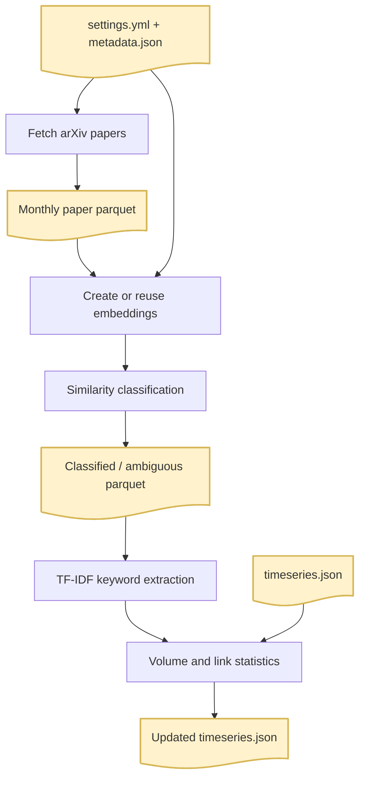

# Monthly pipeline

Fetches arXiv papers for one month, maps them to the project taxonomy, derives topic keywords, and updates the trend time series.

## Pipeline flow



## Modules

| Module | Purpose |
| --- | --- |
| `run_pipeline.py` | CLI entry point and orchestration of all stages. |
| `paths.py` | Defines repository-relative input/output locations. |
| `io.py` | Reads configuration, taxonomy metadata, and time-series JSON; writes the updated time series. |
| `fetch.py` | Retrieves and deduplicates arXiv papers for the requested month. |
| `embed.py` | Loads the embedding model and creates/reuses `.npy` embedding caches. |
| `classify.py` | Computes cosine similarity and assigns T1/T2 taxonomy labels. |
| `keywords.py` | Extracts per-topic TF-IDF keywords from T1 paper abstracts. |
| `stats.py` | Computes paper volumes, co-occurrence links, and cumulative statistics. |
| `demo.ipynb` | Notebook-oriented version of the same workflow. |

## Required inputs

These paths are resolved from the repository root:

| File | Purpose |
| --- | --- |
| `config/settings.yml` | arXiv categories, embedding model, classification thresholds, and keyword settings. |
| `data/metadata.json` | L1 and L2 taxonomy nodes, including node names, descriptions, and parents. |
| `data/timeseries.json` | Existing cumulative trend data. If absent, the pipeline starts a new time series. |

The pipeline retrieves the month’s papers itself from the arXiv API. It requires internet access and may take some time because requests are rate-limited.

## Outputs

For `--year 2026 --month 8`, outputs are written to:

| Path | Contents |
| --- | --- |
| `data/arxiv_data/202608.parquet` | Retrieved paper metadata and abstracts. |
| `data/checkpoints/arxiv/202608/slice_XX.json` | Cached Arxiv data for retries. |
| `data/checkpoints/embeddings/nodes.npy` | Cached taxonomy-node embeddings. |
| `data/checkpoints/embeddings/202608_abstracts.npy` | Cached abstract embeddings. |
| `data/checkpoints/classified/202608_classified.parquet` | Papers receiving one or more T1 labels. |
| `data/checkpoints/classified/202608_ambiguous.parquet` | Below-threshold papers with top candidate nodes. |
| `data/timeseries.json` | Updated monthly volumes, keywords, and co-occurrence links. |

Running the same month again replaces its fetched, embedding, and classified files. Back up `data/timeseries.json` before rerunning a month if you need to preserve its previous cumulative values.

## Run from the CLI

With Pixi (recommended for this repository):

```bash
pixi run python pipeline/run_pipeline.py --year 2026 --month 8
```

Without Pixi, use a Python environment with the dependencies from `pixi.toml` installed (including `arxiv`, `polars`, `sentence-transformers`, `spacy`, `scikit-learn`, `PyYAML`, `numpy`, and `tqdm`):

```bash
python -m pip install arxiv polars sentence-transformers spacy scikit-learn pyyaml numpy tqdm
python pipeline/run_pipeline.py --year 2026 --month 8
```

To use an alternate settings file:

```bash
pixi run python pipeline/run_pipeline.py --year 2026 --month 8 --config /path/to/settings.yml
```
